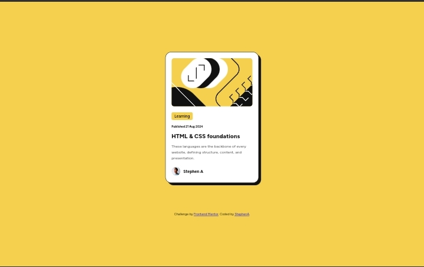

# Frontend Mentor - Blog Preview Card Solution

This is my solution to the [Blog Preview Card challenge on Frontend Mentor](https://www.frontendmentor.io/challenges/blog-preview-card-ckPaj01IcS). Frontend Mentor challenges are designed to help you improve your coding skills by working on real-world projects.

## Table of contents

- [Overview](#overview)
  - [The Challenge](#the-challenge)
  - [Screenshot](#screenshot)
  - [Links](#links)
- [My Process](#my-process)
  - [Built With](#built-with)
  - [What I Learned](#what-i-learned)
  - [Continued Development](#continued-development)
  - [Useful Resources](#useful-resources)
- [Author](#author)
- [Acknowledgments](#acknowledgments)

## Overview

### The Challenge

Users should be able to:

- See hover and focus states for all interactive elements on the page.

### Screenshot




### Links

- [Solution URL](https://github.com/Codestephenn/blog-preview-card-solution)
- [Live Site URL](https://stephenA.github.io/blog-preview-card-solution)

## My Process

### Built With

- Semantic HTML5 markup
- CSS custom properties
- Flexbox
- Mobile-first workflow

### What I Learned

During this project, I focused on improving my use of CSS custom properties (variables) and creating hover effects for better user interaction. Here's a snippet of code that I'm particularly proud of:

```css
/* Hover Effect for Blog Preview Card */
.blog-preview-card:hover {
  transform: translateY(-10px);
  box-shadow: 12px 12px 0 0 var(--card-shadow-color);
}
```

This hover effect adds a subtle yet effective visual cue that enhances the user experience.

### Continued Development

In future projects, I plan to:

- Deepen my understanding of responsive design techniques.
- Explore CSS Grid for more complex layouts.
- Continue improving my JavaScript skills, particularly in making websites more interactive.

### Useful Resources

- [MDN Web Docs on CSS Custom Properties](https://developer.mozilla.org/en-US/docs/Web/CSS/--*)
- [CSS Tricks on Flexbox](https://css-tricks.com/snippets/css/a-guide-to-flexbox/) - A fantastic guide for understanding and implementing Flexbox layouts.

## Author

- Website - [StephenA](https://github.com/Codestephenn)
- Frontend Mentor - [@Codestephenn](https://www.frontendmentor.io/profile/Codestephenn)
- Twitter - [@stephenn_at](https://www.twitter.com/stephenn_at) 

## Acknowledgments

Thanks to [Frontend Mentor](https://www.frontendmentor.io) for providing such a wide variety of challenges that allow developers like me to practice and hone our skills. I also appreciate the helpful community that shares feedback and tips.


